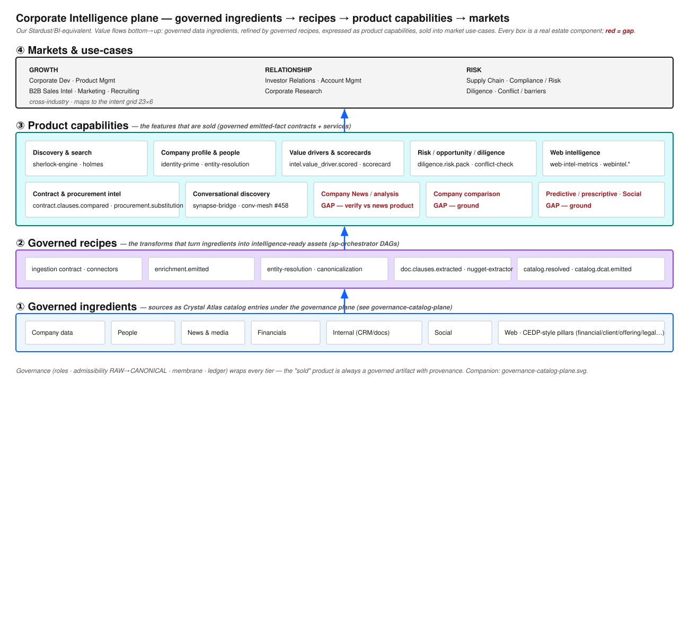

# Corporate Intelligence plane

Our **Stardust / horizontal market-and-business-intelligence equivalent**, reconstructed truthfully
from real estate components (no captured third-party decks or branding). It makes explicit the two
things a sellable intelligence product needs, and shows we have both:

1. **Governed recipes & ingredients** — the data supply, under governance: sources as Crystal Atlas
   catalog entries (① ingredients) refined by governed transforms (② recipes).
2. **Functional product features & capabilities** — the demand side: the intelligence features that
   are actually *sold* (③ capabilities), mapped to market use-cases (④ markets).

This companions [`governance-catalog-plane`](./governance-catalog-plane.md) (the policy⟷catalog
tiers) — that doc governs the ingredients; this one turns them into product.

## ① Governed ingredients (supply)

Company, People, News & media, Financials, Internal (CRM/docs), Social, Web — each admitted as a
Crystal Atlas `source-catalog-entry.v0` under the governance plane (admissibility RAW→CANONICAL,
membrane, ledger). Mirrors the CEDP "pillars of data" (financial/client/offering/people/legal/…).

## ② Governed recipes (transforms)

`ingestion contract` + connectors → `enrichment.emitted` → `entity-resolution`/canonicalization →
`doc.clauses.extracted` (`nugget-extractor`) → `catalog.resolved` / `catalog.dcat.emitted`. These
are governed sp-orchestrator DAGs — the "recipe" pattern — each emitting a provenance-bearing fact.

## ③ Product capabilities (what is sold) — mostly BUILT

| Capability (Stardust-equivalent) | Our component / contract | Status |
|---|---|---|
| Discovery & search | `sherlock-engine`, `holmes` | ✅ |
| Company profile & people | `identity-prime`, `entity-resolution`, `crystal-atlas-contract-intel` | ✅ |
| Value drivers & scorecards | `intel.value_driver.scored`, `scorecard.generated`, `metric-claim-envelope` | ✅ |
| Risk / opportunity / diligence | `diligence.risk.pack.generated`, `conflict-check`, `information-barrier` | ✅ |
| Contract & procurement intel | `contract.clauses.compared`, `procurement.substitution.recommended`, `entitlement.adjacency.inferred` | ✅ |
| Web intelligence | `web-intel-metrics` + `webintel.*` (ai_visibility, backlink, content_gap, serp_rank, site_audit) | ✅ |
| Conversational discovery | `synapse-bridge`; conversational-mesh (**existing issue #458**) | ⚠️ in-flight |
| Company **News / news-analysis** | — | 🔴 GAP (verify vs the news product) |
| Company **comparison** | — | 🔴 GAP |
| **Predictive / prescriptive** · **Social** intelligence | — | 🔴 GAP |

## ④ Markets & use-cases

GROWTH (Corp Dev, Product, B2B Sales Intel, Marketing, Recruiting) · RELATIONSHIP (Investor
Relations, Account Mgmt, Corporate Research) · RISK (Supply Chain, Compliance/Risk, Diligence).
Cross-industry; aligns to the intent grid 23×6.

## Gaps — grounded vs already-tracked (honest dedup)

**Already have open issues (NOT re-filed):** standards/reference-data (7+2), model-catalog (4),
invariant-zones / model-attribution (5), retrieval (2), entity-resolution (3), conversational mesh
(#458). Those stand.

**Newly grounded (0 prior issues):**

1. **Corporate-Intelligence capability matrix & product-feature register** — the coherence artifact:
   bind every `intel.*` / `webintel.*` / `diligence.*` contract + service to a *named* product
   feature × info-type (Company/People/News/Internal/Social) × market use-case, and mark the
   uncovered cells (News, Comparison, Social, Predictive). Turns a pile of contracts into a sellable
   capability catalog.
2. **Master-data / company-hierarchy canonical model** — a Master-Data-360-equivalent: Company ·
   Client Hierarchy · People · Opportunity · Financials · Signings as Crystal Atlas entry families +
   `entity-resolution` linkage across internal + external (D&B-style) sources; the backbone the
   profile/comparison/risk capabilities read from.
3. **Company News / news-analysis capability** (verify vs the existing news product before building).

## Recommendation

The estate is **capability-rich but coherence-poor** here: the governed recipes/ingredients and most
product features exist as contracts + services, but there is no single register that says "these are
the sellable intelligence features, this is their governed supply, these cells are gaps." Ship the
capability matrix (gap 1) first — it converts existing assets into a product story and exposes the
real gaps (News, Comparison, Social, Predictive) precisely.

## Related: reusable internal-model catalog

Beyond corporate intelligence, every business needs a shelf of reusable **internal models** (fraud
/ anomaly, next-best-action, collaborative-filtering recommenders, churn, propensity, segmentation,
forecasting, risk scoring, …). These belong in the same governed frame — as Crystal Atlas
`model-catalog-entry.v0` families served through the model catalog. Tracked as the "top-15 reusable
internal models" register (queued).
