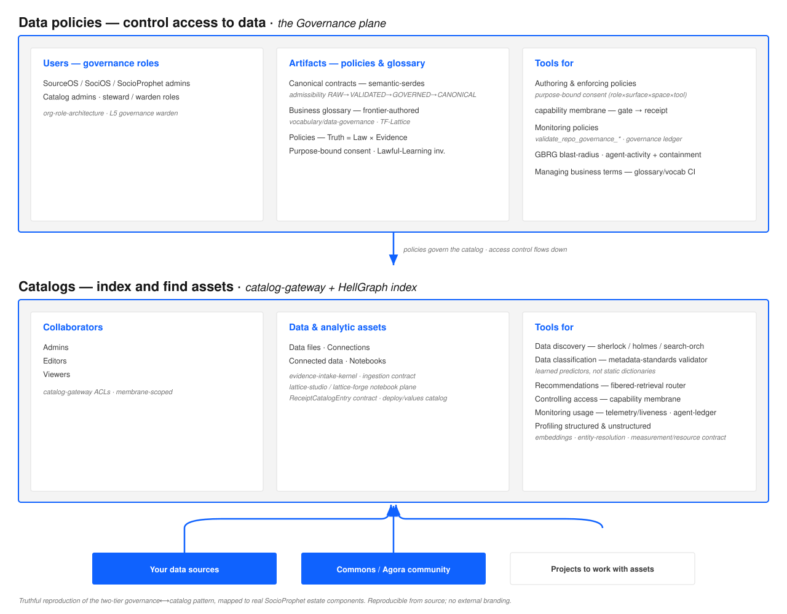

# Governance ⟷ Catalog plane

The estate's data architecture follows the well-worn two-tier **governance-over-catalog** pattern
(the same shape as IBM Watson Knowledge Catalog and comparable data-fabric products): a **policy
tier** that controls access, sitting above a **catalog tier** that indexes and finds assets, with
**access control flowing top→down** and **assets flowing bottom→up** from sources, community, and
projects. This document is the truthful, source-reproducible reference for our version — the SVG is
hand-authored from these mappings, not a captured third-party image, and carries no external
branding.

## Why this reference exists

We validated our design against the industry pattern and it holds: every box has a real estate
component behind it. This doc is the map (concept → our component → status) so onboarding,
architecture review, and gap-tracking all point at the same picture.

## Tier 1 — Data policies (control access to data) → the Governance plane

| Pattern element | Our component | Status |
|---|---|---|
| Users (catalog/knowledge admins) | `org-role-architecture` (SourceOS / SociOS / SocioProphet), steward & warden roles, L5 governance warden | ✅ |
| Artifacts · Data policies | `semantic-serdes` canonical contracts — admissibility tiers RAW→VALIDATED→GOVERNED→CANONICAL; Truth = Law × Evidence; purpose-bound consent; Lawful-Learning invariants | ✅ |
| Artifacts · Business glossary | frontier-authored glossary + vocabulary/data-governance program + TF-Lattice | ✅ (glossary is doc/CI-authored; a browsable glossary **service** is a candidate gap — see below) |
| Tools · authoring & enforcing policies | purpose-bound tool consent (role×surface×space×tool×purpose), capability membrane (gate→receipt), guardrail-fabric | ✅ |
| Tools · monitoring policies | `validate_repo_governance_*` suite + governance ledger/replay, GBRG blast-radius, governed agent-activity + containment | ✅ |
| Tools · managing business terms | vocabulary/data-governance CI, glossary CI | ✅ |

## Tier 2 — Catalogs (index and find assets) → catalog-gateway + HellGraph index

| Pattern element | Our component | Status |
|---|---|---|
| Collaborators (admins/editors/viewers) | `catalog-gateway` ACLs, membrane-scoped access | ⚠️ verify explicit editor/viewer RBAC is first-class |
| Assets · data files / connections / connected data / notebooks | evidence-intake-kernel + ingestion contract; `lattice-studio` / `lattice-forge` notebook plane; `ReceiptCatalogEntry` contract; the `deploy/values` service catalog | ✅ |
| Tools · data discovery | `sherlock-engine` / `holmes` / `search-orchestrator` | ✅ |
| Tools · data classification | metadata-standards validator; learned classifiers (not static dictionaries) | ✅ |
| Tools · recommendations | fibered-retrieval router (descend/abstain gate) | ✅ |
| Tools · controlling access | capability membrane | ✅ |
| Tools · monitoring usage | telemetry/liveness, agent-activity-ledger, `catalog-gateway` ops readout + SLO gate | ✅ (newly landed) |
| Tools · profiling structured & unstructured | `embeddings`, `entity-resolution`, measurement/resource contract | ✅ |

## Feeders

| Pattern element | Our component |
|---|---|
| Your data sources | ingestion pipeline / connections |
| Watson Community | Commons / Agora community + `commons-search` |
| Projects to work with assets | Library⟷Projects connection, workspace/content model, `lattice-studio` |

## Where this reference is useful

- **`docs/architecture/`** (here) — the canonical estate picture for architecture review & onboarding.
- **`apps/catalog-gateway`** — the catalog tier; link this from its README as the "where I fit" map.
- **`semantic-serdes`** — the policy/contract tier; the admissibility ladder is the access-control spine.
- **metadata-standards** — the classification/profiling tooling referenced in tier 2.
- **collaborator/onboarding docs** — the two-tier mental model for new stewards, editors, viewers.

## Candidate gaps (verify before grounding — not asserted)

1. **Browsable business-glossary surface.** We have a frontier-authored glossary + vocab CI, but not
   necessarily a first-class *browsable* glossary artifact inside the catalog (tier-1 "Business
   glossary" as a catalog-visible object). Worth confirming.
2. **First-class editor/viewer RBAC on catalog-gateway.** Confirm the collaborator roles are explicit
   and enforced (not only membrane-scoped).
3. **Community feed → catalog ingestion.** Confirm the Commons/Agora community path materializes into
   catalog assets the way "Watson Community" feeds the catalog in the pattern.
